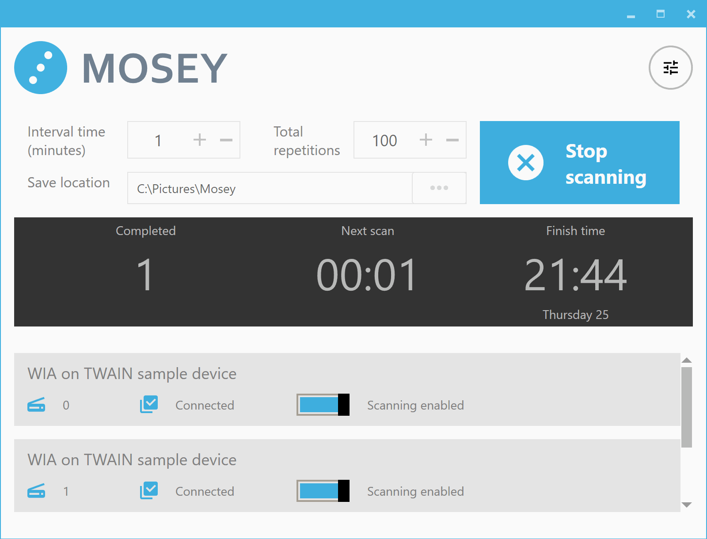
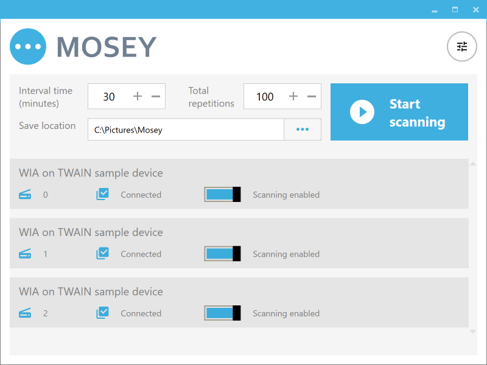
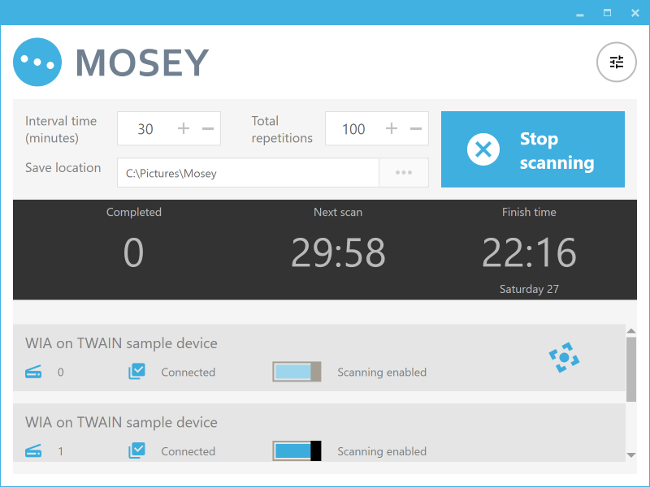
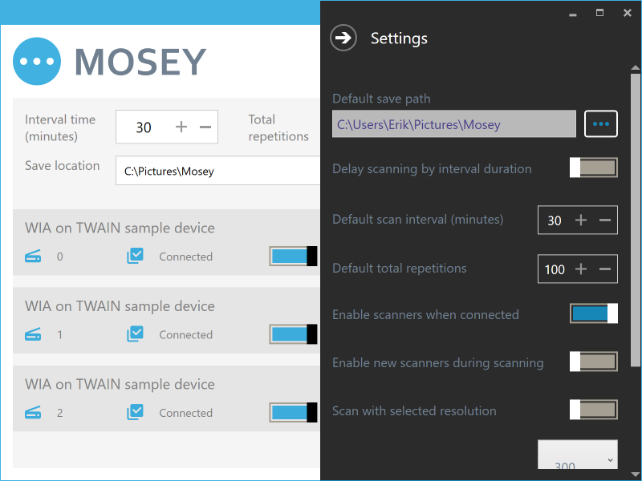

# Mosey
Multi scanner interval imaging tool. Runs on Windows 7 and up

Get the [latest release](https://github.com/Erik-White/Mosey/releases)

### Quick start
- Download the  [latest release](https://github.com/Erik-White/Mosey/releases) for your version of Windows (i.e. 32 or 64 bit)
- Install the latest drivers for your scanner, connect it and power it on
- Run the executable
- Start scanning!

### Optional installation steps
- Copy the executable to `C:\Program Files\Mosey` (or similar)
- Create a shortcut to your desktop

### Screenshots

